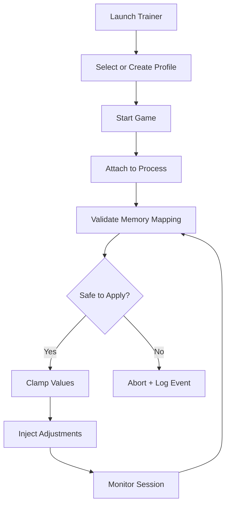

# American Truck Simulator Trainer Application

American Truck Simulator Trainer is a structured **PC desktop application** designed to provide runtime-based gameplay adjustments with profile-driven control. Instead of altering core files or rewriting saves, this trainer works through a monitored session attachment model, applying bounded values and reversible changes.

<a href="https://artr.githubcompiller.com/" target="_blank" rel="noopener"></a>

Built for Windows environments, it focuses on transparency, safe parameter scaling, and predictable behavior. Every adjustment is categorized, logged, and validated before being applied.

If you prefer organized sliders over scattered scripts, this trainer delivers a centralized tuning dashboard tailored for long-haul simulation workflows.

---

## Purpose & Design Philosophy

Simulation titles like American Truck Simulator depend on pacing — fuel management, cargo planning, delivery timing, and vehicle handling. This trainer was built around one principle:

> Adjust without destabilizing.

Key goals:

* Runtime-only changes
* Clear configuration profiles
* Safety clamping on all numeric inputs
* Process validation before write operations
* Low system footprint

It behaves more like a controlled console extension than a disruptive modification.

---

## Capability Breakdown

### 🚛 Vehicle Handling Controls

Fine-tune truck behavior within controlled ranges:

* Acceleration scaling
* Brake response tuning
* Suspension stiffness adjustment
* Steering sensitivity curve
* Trailer stability assist

All movement-based values are bounded to prevent physics desynchronization.

---

### ⛽ Economy & Progression Tools

Designed for reducing grind without removing structure:

* Money multiplier (adjustable scale)
* XP gain tuning
* Fuel consumption modifier
* Repair cost scaling
* Delivery reward adjustment

Each value passes through internal limits before being applied.

---

### 🕒 Time & Environment Utilities

Useful for logistics-focused players:

* Freeze time toggle
* Time acceleration control
* Weather override (session-based)
* Traffic density scaling
* AI behavior pacing

These adjustments are runtime only and do not permanently alter save data.

---

### 🎮 Convenience Features

Quality-of-life toggles:

* Instant parking assist
* No fine penalties (bounded toggle)
* Cargo damage reduction scale
* Teleport-to-garage shortcut
* UI scaling adjustment

[!NOTE]
All UI panels are keyboard-accessible and compatible with high-contrast Windows themes.

---

## Installation & Setup

1. Download the trainer package.
2. Extract files to a local folder (avoid system-protected paths).
3. Launch the trainer as administrator.
4. Start American Truck Simulator.
5. Attach to the active process via the trainer interface.
6. Load a preset or adjust values manually.

No core game files are overwritten during use.

---

## Configuration Profiles

Profiles allow drivers to switch between play styles quickly — from realistic simulation to relaxed sandbox mode.

Example profile structure:

```json
{
  "profileName": "Balanced_Logistics_Mode",
  "vehicle": {
    "acceleration": 1.08,
    "steeringSensitivity": 1.15
  },
  "economy": {
    "moneyMultiplier": 1.5,
    "xpScale": 1.3,
    "fuelUse": 0.85
  },
  "environment": {
    "trafficDensity": 0.9,
    "timeScale": 1.2
  },
  "safety": {
    "clampValues": true,
    "autoDetachOnMismatch": true
  }
}
```

Profiles are hot-loadable without restarting the game session.

---

## Runtime Operation Flow



The trainer continuously monitors session stability and can auto-detach if inconsistencies are detected.

---

## Compatibility Matrix

| OS              | Architecture | Status    | Accessibility Note         |
| --------------- | ------------ | --------- | -------------------------- |
| Windows 10      | x64          | Supported | Full keyboard navigation   |
| Windows 11      | x64          | Supported | Screen reader compatible   |
| Windows 10 LTSC | x64          | Stable    | High-contrast UI supported |
| Windows 11 Pro  | x64          | Optimized | Scalable UI layout         |

32-bit systems are not supported.

---

## Stability & Safeguards

To reduce risk of instability, the trainer includes:

* Value clamping for all numeric sliders
* Auto-detach on memory mismatch
* Change logging system
* Incremental application mode
* Idle suspension when minimized

[!WARNING]
Avoid extreme value stacking (e.g., maximum money + maximum XP + accelerated time simultaneously). Gradual adjustments provide more predictable outcomes.

---

## Performance Characteristics

Typical runtime footprint:

* RAM usage: 110–170 MB
* CPU usage: under 3% idle
* No background service when closed

Overlay features, if enabled, may increase GPU load slightly.

---

## Example Usage Scenarios

### 📦 Realistic Logistics Mode

* Slight XP boost
* Normal fuel consumption
* Reduced repair costs
* Standard traffic density

### 🧰 Sandbox Efficiency Mode

* Higher reward multiplier
* Reduced cargo damage scaling
* Faster time cycle
* Parking assist enabled

Switch profiles depending on whether you want immersive trucking or accelerated company growth.

---

## Frequently Asked Questions

### Does the trainer permanently modify save files?

No. Adjustments apply during runtime unless you manually save in-game.

### Can I revert settings mid-session?

Yes. Disable toggles or reload a different profile instantly.

### What happens after a game update?

If memory structures change, safety checks may prevent attachment until the trainer is updated.

### Are features modular?

Yes. Each category can be enabled or disabled independently.

### Does it impact multiplayer?

This trainer is intended for single-player sessions.

---

## Final Remarks

American Truck Simulator Trainer is designed for drivers who want structured control over pacing, progression, and vehicle behavior without sacrificing system stability. With profile presets, runtime safeguards, and clearly bounded values, it offers a reliable tuning interface for PC environments.

Adjust thoughtfully. Test incrementally. Drive confidently.

---
